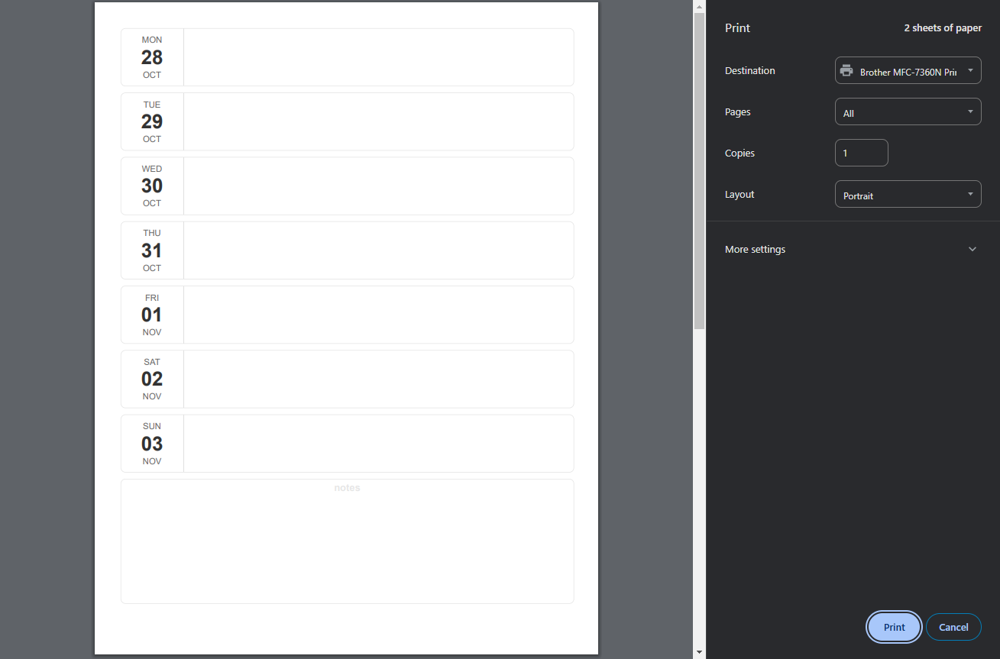

# calendarium 🤖🗓️
If you want a printable weekly calender autogenerated to print (and you have python) you can use `calendarium` for that.
A simple python script to create a printable HTML calendar so you can print from your browser.

## How to use
1. Clone the repository on your machine
2. Create a virtual environment `uv venv`
3. Install dependencies (only 1) `uv sync`
4. Run the script from your command line
```
python .\src\calendarium.py 28/10/2024 10/11/2024 destination-file
```
5. a file `destination-file.html` will be created and your browser will open ready to print it.

## How it looks


## How it works
This very first version just parses the dates provided, creates HTML for your calendar and opens it in your browser so you can print it (it is recommended to disable headings and footer in the print dialog for prettier final result).

## Modifications
You can tweak the template in `src/templates`

## Contributions
Contributions and suggestions are welcome, just create a PR or open an issue.
Keep in mind that this is a toy project, so don't expect first class support 😉

## License
GNU GENERAL PUBLIC LICENSE v3